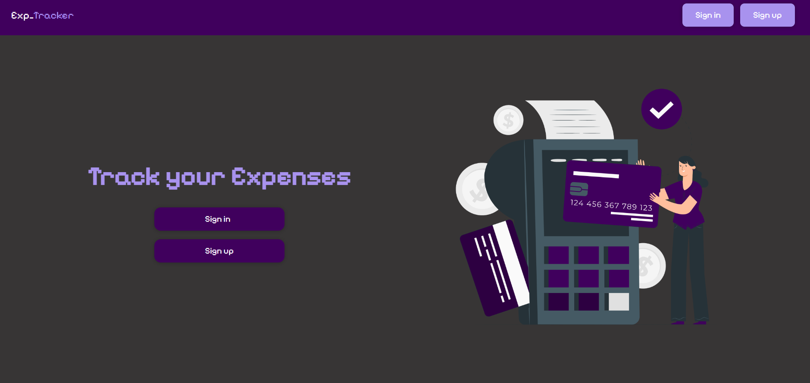
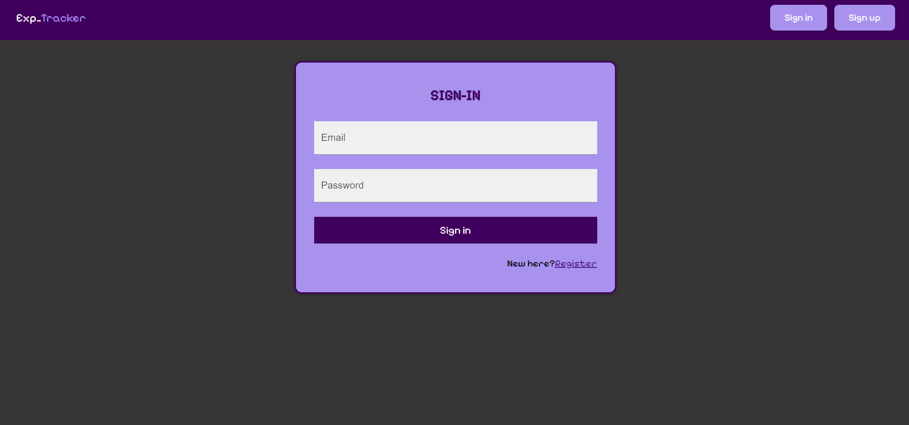
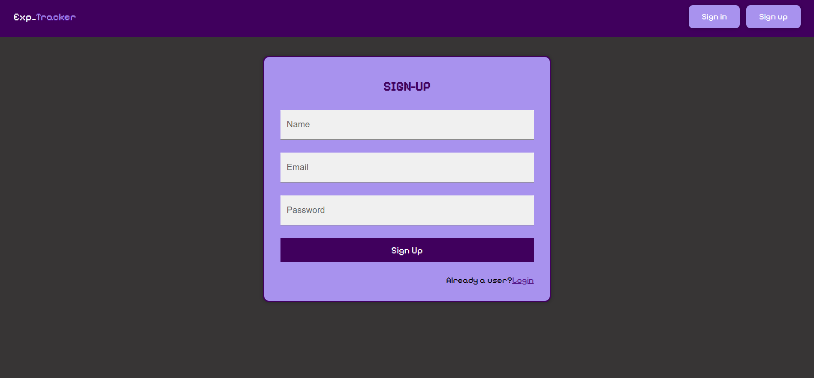
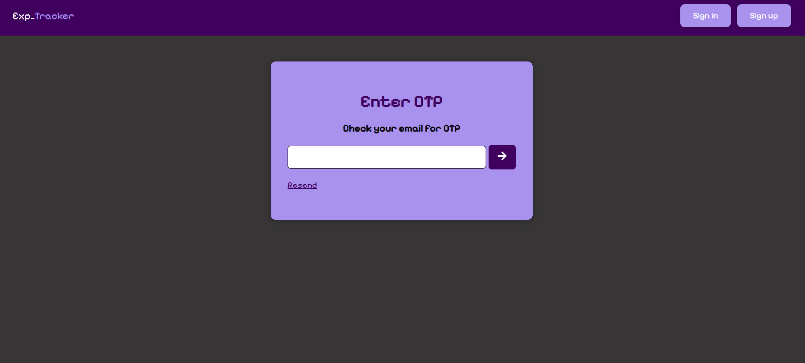
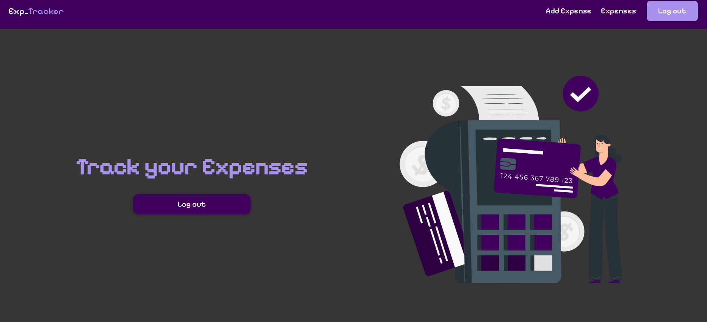
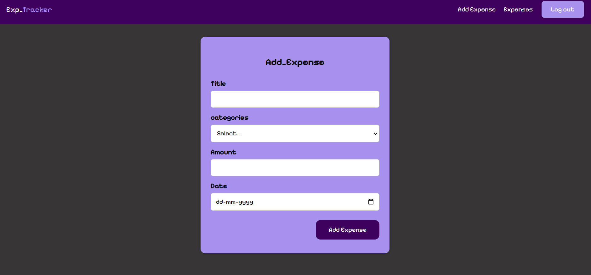
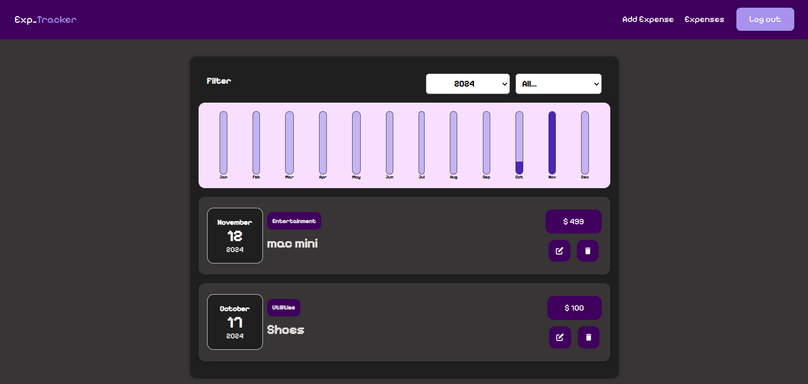
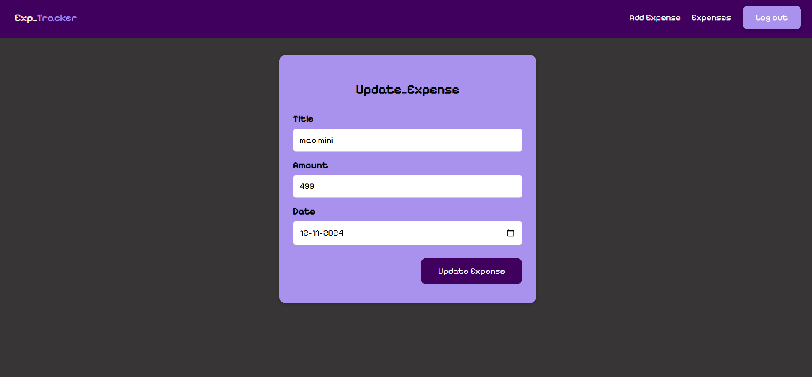

# Expense_Tracker_Frontend

Modernizing React with Vite: A GitHub Repository for Transitioning from Old ExpenseTrackerto New to New ExpenseTracker

## Description

Introducing Expense_Tracker_Frontend

ExpenseTracker is a cutting-edge and user-centric expense management app designed to revolutionize the way you handle your finances. Whether you're a meticulous budgeter or someone looking to gain better control over their spending, ExpenseTracker is your go-to solution for seamless and efficient expense tracking.

## Technologies Used

List the key technologies and frameworks used in your Expense_Tracker_Frontend application, such as:

- React
- Additional libraries or dependencies you've utilized (e.g. Axios, etc.)

## Installation

Provide step-by-step instructions on how to install and set up your application. Include any prerequisites, such as having Node.js and specify any environment variables or configuration files that need to be set up. For example:

1. Clone the repository:

```
git clone https://github.com/Kalyankumarpokkula/Expense-Tracker.git
```

2. Navigate to the project directory:

```
cd Expense-Tracker
```

3. Install dependencies:

```
npm install
```

4. Start the development server:

```
npm run dev
```

## Backend

This is a backend of the this application

1. Clone the repository:

```
git clone https://github.com/kalyanKumarPokkula/Expense-Tracker-Backend.git
```

2. Navigate to the project directory:

```
cd Expense-Tracker-Backend
```

3. Install dependencies:

```
npm install
```

4. Start the development server:

```
npm run dev
```

## Usage

To efficiently manage expenses, users must first create an account to access the ExpenseTracker. If a user doesn't have an account, they can easily register and create one. Once logged in, users can seamlessly add new expenses, specifying the date, month, and year of the expense, along with details such as the name and price. This streamlined process empowers users to maintain a comprehensive record of their expenditures and gain better control over their finances.

## Screenshots

### Homepage



### login Page



### signup page



### OTP verfiy page



### success logged in welcome page



### add new expenses page



### All expenses page



### update expense page



## File Structure

Explain the structure of your project's directories and files. Provide a brief overview of each major directory and its purpose. For example:

- /src: Contains the source code of your React application.

## Contributing

code enhancements, bug fixes, or new features to collectively improve the application's functionality and user experience other Developers can Contribute.
